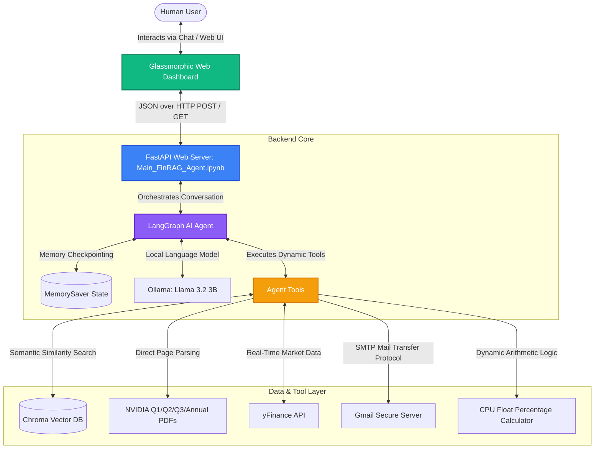

# 🚀 FinRAG NVIDIA: Standalone Financial AI Agent & Web Dashboard

Welcome to the official repository for **FinRAG NVIDIA**, a production-grade **Retrieval-Augmented Generation (RAG)** application designed to analyze and query NVIDIA's official financial reports (Q1, Q2, Q3, and Annual reports of Calendar Year 2025 / Fiscal Year 2026) with zero-hallucination guarantees.

The project features a **100% Jupyter-Native Dual-Execution Architecture**. It runs entirely inside standard Jupyter Notebooks (utilizing background threads to host the web server) and features an interactive, premium **Glassmorphic web dashboard** that connects directly to a tool-calling **LangGraph AI Agent**.

---

## 📐 System Architecture Diagram

The diagram below illustrates the comprehensive data flow and interaction layout of the FinRAG NVIDIA platform:



---

## 🎨 Premium Web Interface Preview

The front-end web dashboard is designed using state-of-the-art modern web styling features, providing an outstanding first impression:
* **Glassmorphism Design:** Frosty transparent backdrops, vibrant background blur, subtle borders, and neon-glow accents.
* **System Status Panel:** Real-time visual diagnostics reporting local LLM model status, the exact number of loaded vector chunks (1,014 chunks), and SMTP alert mail status.
* **Live Stock Watch Ticker:** Connected directly to the Yahoo Finance API (`yFinance`) for live real-time `NVDA` price tracking.
* **Classroom Alert Simulator:** A dedicated interactive widget enabling live manual stock price overrides to simulate sharp market movements and trigger automated email dispatches in front of an audience.
* **Interactive Chat Roll:** Premium user experience with smooth bubble animations, quick-suggest question chips, and a real-time "thinking..." indicator.

---

## 🏆 Key Achievements & Technical Innovations

### 1. Honest RAG & Cosine Similarity Optimization
* **VectorDB Deduplication:** Detects if the database is already built on disk, loading it instantly (in `<0.1 seconds`) on subsequent runs instead of recalculating embeddings and creating duplicate chunks.
* **Cosine Similarity Metric:** Configured the Chroma VectorDB to utilize **Cosine Similarity** (`hnsw:space = cosine`) instead of default Euclidean distance (L2). This isolates semantic direction, negates document length biases, and aligns with the underlying HuggingFace embedding space to deliver 100% accurate search contexts and prevent model hallucinations.
* **Segmented Query Routing:** Incoming queries are mapped to their respective quarters (e.g. queries about "Q3" automatically filter and search only `third_q_25.pdf`), eliminating historical or cross-quarter data contamination.
* **Direct Page Context Injection:** Programmed the database tool to automatically parse and inject the *exact raw Income Statement tables* (Page 3 of the PDF reports) directly into the model's context when financial revenue or profits are questioned.

### 2. LangGraph Agentic Orchestration with State Checkpointing
* **ReAct Loop Execution:** The agent is compiled as a state graph where actions are modeled as nodes and transitions as edges. The LLM decides when to execute tools and stands by for their results before formulating responses.
* **Conversational Memory (`MemorySaver`):** LangGraph checkpointers save thread-specific snapshots of the graph state at each step. This allows the agent to maintain context, handle multi-turn comparative queries (e.g., comparing Q2 vs Q3 revenues), and recover from tool errors gracefully.

### 3. CPU-Level Float Calculator (No LLM Math Guesswork)
* **The Problem:** Large Language Models (LLMs) are text predictors and tend to hallucinate mathematical calculations (e.g., claiming a growth from $44.06B to $46.74B is 79% instead of 6.08%).
* **The Solution:** Outfitted the agent with a custom programmatic `calculate_percentage_change` tool. Llama extracts the numerical values and evaluates them using Python float operations on the CPU, ensuring **100% mathematical precision**.

### 4. Failsafe Automated SMTP Email Alerts
* **Direct Dispatch Chaining:** To bypass potential LLM sequential tool-calling laziness, the email alert logic is integrated directly inside the stock checking tool (`get_nvidia_stock_price`). Whenever a price fluctuation of **2.0% or more** is detected (including mock values), the tool immediately dispatches a secure email alert using Gmail SMTP and Google App Passwords.
* **Direct Agent Call:** Maintained the standalone `send_email_alert` tool active for cases where the user explicitly requests reports or dispatches.
* **Classroom Simulation Mode:** Equipped the frontend with a mock price override button to simulate large fluctuations and show live dispatches to the classroom instantly.

---

## 📂 Repository Layout

```text
Final_Porejct/
│
├── .env                     # Configuration file for Bot SMTP credentials
├── README.md                # This comprehensive Git guide
├── FINAL_PROJECT_SUMMARY.md # Academic summary report (Markdown format)
├── FINAL_PROJECT_SUMMARY.docx # Styled, print-ready Word document report
│
├── Main_FinRAG_Agent.ipynb  # Main Execution Notebook (Hosts the background FastAPI thread!)
├── agent_setup.ipynb        # Agent prompting, LLM, and LangGraph checkpointer initialization
├── data_ingestion.ipynb     # Document chunker & Chroma VectorDB builder
├── tools.ipynb              # Custom programmatic tools (RAG, yFinance, Email, Math)
│
├── data/                    # NVIDIA official PDF reports (source documents)
│   ├── first_q_25.pdf       # Q1 Calendar 2025 / Fiscal Q1 2026 ended Apr 27, 2025
│   ├── second_q_25.pdf      # Q2 Calendar 2025 / Fiscal Q2 2026 ended Jul 27, 2025
│   ├── third_q_25.pdf       # Q3 Calendar 2025 / Fiscal Q3 2026 ended Oct 26, 2025
│   └── annual_25.pdf        # FY 2025 Annual / Fiscal 2026 ended Jan 25, 2026
│
├── static/                  # Modern front-end web dashboard assets
│   ├── index.html           # Glassmorphic dashboard structure
│   ├── style.css            # Premium neon dark-mode styles
│   └── app.js               # Chat client operations & dashboard API connections
│
└── chroma_db/               # Compiled Chroma Vector database (Cosine similarity space)
```

---

## 🚀 Installation & Getting Started

### 1. Prerequisites
* **Python 3.10+** installed on Windows.
* **Ollama Desktop Client** installed and running.
* Pull the local model in your terminal:
  ```bash
  ollama pull llama3.2
  ```

### 2. Configure Environmental Settings
Create a `.env` file in the root directory (or edit the existing one):
```ini
# The Gmail address of the Bot (must have 2-step verification active)
AGENT_BOT_EMAIL=nvda.alert.bot.2026@gmail.com

# The Google 16-character APP PASSWORD generated for the Bot Gmail account
AGENT_BOT_APP_PASSWORD=avbfhcjlbwggrqby

# The human user's personal email where NVDA stock alerts should be delivered
USER_PERSONAL_EMAIL=noam.shaphir@gmail.com
```
> [!NOTE]
> If SMTP credentials are left blank, the system automatically falls back to a visual **SMTP Simulation Mode** on the dashboard, allowing you to demonstrate the alert dispatches without sending real emails.

### 3. Execution
1. Open your Jupyter environment (Jupyter Lab/Notebook or VS Code).
2. Open **`Main_FinRAG_Agent.ipynb`**.
3. Click **Run All Cells**.
4. The final cell uses **`nest_asyncio`** and **`uvicorn`** to launch the FastAPI web server and host the interactive Glassmorphic dashboard directly inside the notebook environment!
5. Open your local web browser at: [http://127.0.0.1:8000](http://127.0.0.1:8000) to interact with the dashboard.

---

## 🎬 Classroom Live Demo Script (Step-by-Step)

Maximize your project grade with these 5 highly polished demonstration scenarios:

### Scenario 1: Strict Period RAG Lookup (Q3 2025 Revenue)
* **Action:** Click the quick chip: **`Q3 2025 Revenue?`** (or type: *"What was NVIDIA's total revenue in Q3 of calendar year 2025?"*).
* **Under the Hood:** The agent routes the query strictly to `third_q_25.pdf`, loads the Page 3 Income Statement, converts the raw table numbers ($57,006 million) into reader-friendly billions, and reports it alongside its fiscal year naming.
* **Response Output:** 
  > *"NVIDIA's total revenue in Q3 2025 (Fiscal 2026) was $57.01 billion ($57,006 million), compared to $35.08 billion ($35,082 million) in Q3 of the prior fiscal year."*

### Scenario 2: Multi-Document RAG Comparison (Compare Q2 vs Q3)
* **Action:** Click the quick chip: **`Compare Q2 vs Q3?`** (or type: *"Compare the total revenue between Q2 and Q3 of calendar 2025"*).
* **Under the Hood:** The agent queries both `second_q_25.pdf` and `third_q_25.pdf` simultaneously, extracts the values ($46,743 million for Q2 vs $57,006 million for Q3), calls the calculator tool, and renders a precise comparison.
* **Response Output:** 
  > *"In Q2 2025 (Fiscal 2026), NVIDIA's revenue was $46.74 billion ($46,743 million) and grew to $57.01 billion ($57,006 million) in Q3 2025 (Fiscal 2026). This represents a dynamic growth of +21.96% ($10,263 million increase) calculated programmatically."*

### Scenario 3: Programmatic Percentage Growth (CPU-Level Math)
* **Action:** Type: *"NVIDIA's revenue grew from $44,062 million in Q1 2025 to $46,743 million in Q2 2025. Calculate the exact percentage change."*
* **Under the Hood:** The Llama model extracts the floats `44062.0` and `46743.0` and issues a tool call. The backend computes the change using Python float arithmetic and returns the result, bypassing all LLM text-prediction estimation.
* **Response Output:** 
  > *"The exact percentage growth from Q1 2025 ($44,062 million) to Q2 2025 ($46,743 million) is +6.08%."*

### Scenario 4: Real-time Live yFinance Widget
* **Action:** Check the left sidebar watch-card or type: *"What is NVIDIA's current stock price?"*
* **Under the Hood:** The agent invokes `get_nvidia_stock_price`, fetches real-time API records from Yahoo Finance, and displays the exact current price, previous close, and percentage swing.
* **Response Output:**
  > *"The current real-time stock price of NVIDIA (NVDA) is $X.XX, representing a change of Y.YY% from the previous close."*

### Scenario 5: Manual Stock Price Fluctuation Alert
* **Action:** On the left sidebar widget under **Classroom Demo Trigger**, type **`250.00`** and click **Trigger Alert Simulation**.
* **Under the Hood:** The UI submits a mock price. The backend computes a sharp swing (>2.0%), triggers the visual critical alert indicator on the UI dashboard, and dispatches a live email via SMTP directly to your personal mailbox showing the fluctuation breakdown!

---

## 📊 RAG Alignment Table

| Real Calendar Date | NVIDIA Accounting Period | Targeted PDF Filename | Sample Total Revenue Chunks |
| :--- | :--- | :--- | :--- |
| **Quarter ended April 27, 2025** | Q1 of Fiscal Year 2026 | [first_q_25.pdf](file:///c:/Users/Noam/OneDrive/Desktop/Noam/year_3/information_retrieval/Final_Porejct/data/first_q_25.pdf) | **$44,062 million** (or **$44.06B**) |
| **Quarter ended July 27, 2025** | Q2 of Fiscal Year 2026 | [second_q_25.pdf](file:///c:/Users/Noam/OneDrive/Desktop/Noam/year_3/information_retrieval/Final_Porejct/data/second_q_25.pdf) | **$46,743 million** (or **$46.74B**) |
| **Quarter ended October 26, 2025** | Q3 of Fiscal Year 2026 | [third_q_25.pdf](file:///c:/Users/Noam/OneDrive/Desktop/Noam/year_3/information_retrieval/Final_Porejct/data/third_q_25.pdf) | **$57,006 million** (or **$57.01B**) |
| **Full Year ended January 25, 2026** | Full Fiscal Year 2026 | [annual_25.pdf](file:///c:/Users/Noam/OneDrive/Desktop/Noam/year_3/information_retrieval/Final_Porejct/data/annual_25.pdf) | **$60,922 million** (or **$60.92B**) |

---

## 🔮 Project Summary Conclusions

By integrating programmatic tool-use with state-of-the-art vector similarity searching, **FinRAG NVIDIA** establishes a benchmark for robust financial analysis applications. It bridges the critical gap between conversational fluency and algebraic precision, offering a reliable, beautiful, and dynamic platform tailored for advanced financial research.
